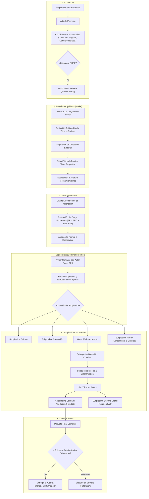

# Documento 02 — Flujo Integral de Negocio y Ciclo de Vida del Proyecto
**Sistema:** PanHouse Gestor Editorial  
**Fecha:** Octubre 2026  

---

## 1. El Flujo Macro de Producción Editorial

El proceso de PanHouse Gestor Editorial no es una línea de montaje rígida y puramente secuencial. Inicia con una secuencia lineal estricta de onboarding comercial y estratégico, y tras la asignación al Especialista Editorial, se ramifica en **subprocesos especializados que corren en paralelo**, coordinados por hitos y compuertas de calidad (gates).

---

## 2. Detalle Etapa por Etapa

### Etapa 1: Comercial (Alta e Inicio)
- **Actores:** Asesor Comercial (`comercial`).
- **Acciones:**
  1. Registra al Autor con sus datos canónicos (nombre legal, nombre artístico, país, nacionalidades, correo, teléfono, personalidad, ocupación, redes sociales).
  2. Crea el Proyecto asociando el Autor, la Unidad de Negocio, el Presupuesto y el Tipo General de Servicio (`EF`, `CR`, `SE`).
  3. Carga las condiciones contractuales: capítulos pactados, páginas estimadas, fecha de firma del contrato, velocidad de ejecución (Normal / Express en meses), alianza comercial y condiciones especiales de diagramación/ilustración.
- **Regla Guardiana:** Comercial **NO** puede definir si el servicio Crudo es "Tripa" o "Capítulo". La especificación queda como *"Pendiente de RRPP"*, y la fecha de cierre permanece sin calcular.
- **Readiness:** El backend deriva de forma reactiva `listoParaRrpp`. Cuando todos los campos contractuales requeridos están completos, Comercial hace clic en *"Notificar a RRPP"* (operación idempotente protegida con `notificadoRrpp = true`).

---

### Etapa 2: Relaciones Públicas (Intake y Diagnóstico Inicial)
- **Actores:** Responsable de RRPP (`rrpp` — Paola Morales / Daniel Valente).
- **Acciones:**
  1. Recibe el proyecto en la bandeja de *Nuevos Ingresos RRPP*.
  2. Sostiene la reunión de diagnóstico inicial con el autor y genera la bienvenida formal.
  3. **Decisión Crítica:** Define si el proyecto Crudo es `CRUDO - TRIPA` o `CRUDO - CAPÍTULO`. Al seleccionar este valor, el sistema calcula de inmediato la **Fecha de Cierre Proyectada** sumando el SLA correspondiente a la fecha de inicio.
  4. Asigna la **Colección PanHouse** correspondiente al tema del libro.
  5. Completa la caracterización de la Ficha Editorial (público objetivo, rango de edad, perfil, propósito social, objetivos comerciales del autor, tono y estilo, posibles títulos/subtítulos).
  6. Registra minutas, enlaces de diagnóstico y observaciones comerciales (venta cruzada).
- **Handoff a Jefatura:** RRPP hace clic en *"Mandar a Jefatura"* (`notificarJefatura = true`). El proyecto pasa al estado de *Pendiente de Asignación*.

---

### Etapa 3: Jefatura de Área (Distribución y Control de Capacidad)
- **Actores:** Jefa de Área (`jefe_area` — Mariángely Romero / Sthephania Silva).
- **Acciones:**
  1. Monitorea la bandeja de proyectos pendientes de asignación.
  2. Consulta el tablero de **Carga Ponderada de Especialistas**, evaluando la complejidad acumulada según el tipo de servicio:
     - `EF` (Escritura Fantasma): Peso 4 (180 días)
     - `EEC` (Edición Estilo por Capítulo): Peso 3 (150 días)
     - `EET` (Edición Estilo Tripa Completa): Peso 2 (150 días)
     - `SE` (Sello Editorial): Peso 1 (60 días internos / 90 comerciales)
  3. Asigna formalmente el proyecto a un Especialista Editorial (`especialistaId`) y designa a la Jefa de Área responsable del seguimiento (`jefeAreaId`).
  4. La asignación es una transacción atómica que registra el hecho en el log de auditoría histórico y notifica al Especialista.

---

### Etapa 4: Especialista Editorial (Project Command Center)
- **Actores:** Especialista asignado (`especialista`).
- **Responsabilidad Integral:** El Especialista es el dueño del proyecto de punta a punta, punto único de contacto con el autor, orquestador de todas las áreas y custodio de la trazabilidad.
- **Acciones Iniciales Inmediatas:**
  1. **Primer Contacto Obligatorio:** Debe contactar al autor por WhatsApp en un plazo máximo de 24 horas laborables.
  2. **Reunión Operativa:** Explica el proceso, valida expectativas, aclara el cronograma y define entregables.
  3. **Configuración de Trazabilidad:** Inicializa la estructura estándar de carpetas en Google Drive y el cronograma formal.
  4. Despacha las solicitudes a los subprocesos de Edición, Creativa, Corrección y Diseño.

---

## 3. Subpipelines Operativos Paralelos

### 3.1 Subpipeline de Edición
1. **Solicitud de Editor:** El Especialista solicita editor a la Jefatura de Edición.
2. **Asignación:** La Jefa de Edición (`jefe_edicion` — Manuela Traettino) evalúa la carga de los editores y asigna el proyecto al Editor (`editorId`).
3. **Flujo según Servicio:**
   - **EF (Escritura Fantasma):** Se realiza estructuración previa -> Extracción de contenido con el autor (grabada y transcrita) -> Editor redacta y edita en tandas de 3 días laborables por capítulo.
   - **EEC (Crudo por Capítulos):** Editor recibe capítulo a capítulo (3 días hábiles por entrega) -> Especialista envía al autor -> Autor tiene 3 días hábiles para feedback -> Editor aplica feedback.
   - **EET (Crudo Tripa Completa):** Editor recibe tripa dividida en 2 partes (3 días hábiles para la primera parte) -> Elaboración de tripa completa armada -> Autor tiene 5 días para feedback.
   - **SE (Sello Editorial):** Manuscrito completo del autor; no requiere edición de contenido de base, pasa a revisión y adecuación editorial.
4. **Armado de Tripa Completa y Kit Editorial:** El editor entrega tripa completa con feedback aplicado + Kit Editorial (sinopsis, resumen, sobre el autor).

---

### 3.2 Gate de Título y Subtítulo
- **Compuerta de Negocio:** **Sin título y subtítulo definitivos aprobados por el autor, queda estrictamente bloqueada la Reunión Creativa.**
- Una vez cerrado el título en el Project Command Center, el Especialista envía la solicitud formal a Dirección Creativa.

---

### 3.3 Subpipeline de Dirección Creativa y Portada
1. **Reunión Creativa:** Participan Líder Creativo (`lider_creativo`), Especialista y Autor. La sesión es grabada y transcrita.
2. **Brief Creativo:** El Líder Creativo redacta el Brief Creativo; el Especialista lo envía al autor (máximo 1 día para aprobación).
3. **Conceptos de Portada:** El Líder Creativo genera de 2 a 3 propuestas conceptuales.
4. **Gate Obligatorio de RRPP:** **Las propuestas de portada NO van directo al autor.** RRPP (Paola Morales) revisa y aprueba internamente los conceptos.
5. **Elección del Autor:** Tras el visto bueno de RRPP, las portadas se cargan para revisión del autor en su Portal. El autor aprueba una o aporta feedback. Al aprobar, el Líder Creativo libera los recursos en alta resolución (Freepik/PDF/fuentes).

---

### 3.4 Subpipeline de Corrección Ortotipográfica
1. **Selección y Contrato:** El Especialista ubica a un corrector en la base de correctores freelance, confirma disponibilidad y gestiona el contrato con Talento Humano.
2. **Asignación Formal:** Al confirmarse el contrato, se envía la tripa completa para corrección.
3. **Plazo Estándar:** 5 días continuos de trabajo (para manuscritos estándar hasta 120 páginas Word).
4. **Entregables:** Word con control de cambios activo e Informe Técnico de Corrección.
5. **Recepción:** El Especialista y Jefatura verifican el resultado, aceptan cambios para preparar el texto de maquetación y registran los tiempos en el módulo de seguimiento.

---

### 3.5 Subpipeline de Diseño y Diagramación
1. **Asignación de Diseñador:** El Especialista asigna un diseñador gráfico (`disenadorId`) evaluando su carga activa.
2. **Muestra de Diagramación:** Diseñador entrega muestra de 3 capítulos en 3 días. Autor revisa y aprueba estilo visual (fuentes, márgenes, intertítulos).
3. **Tripa para Diagramar:** El Especialista toma la tripa corregida, agrega página de créditos según la unidad (PanHouse, Maxwell, Karen Hoyos), preliminares, marca frases destacadas y entrega al diseñador. Plazo: 5 días hábiles (normal) o 15 días hábiles (diagramación especial).
4. **Cubierta Extendida:** Diseñador maqueta lomo, portada y contraportada con solapas en 3 días. Se envía a revisión interna de identidad PanHouse y al Líder Creativo para verificación contra el concepto original. Con el visto bueno interno, se envía a aprobación final del autor.

---

### 3.6 Subpipeline de Calidad y Validación (Rondas Iterativas)
1. **Fase 1 (V1 Diagramada):** La primera versión completa diagramada entra a control de calidad (`soporte_editorial`).
2. **Revisión de Calidad:** El validador revisa contra la lista de chequeo oficial y genera el PDF comentado con incidencias.
3. **Ciclo de Ajustes (Validaciones F2.1 a F2.5):**
   - Diseñador aplica correcciones -> Sube nueva versión.
   - Calidad valida que los comentarios hayan sido aplicados.
   - Se itera hasta que la tripa esté 100% limpia de errores técnicos.
4. **Aprobación del Autor:** El archivo limpio se envía al autor (1 día para revisión). Al recibir el visto bueno, se tramitan los **Números Legales** (ISBN y Depósito Legal).
5. **Fase 3 (Revisión Final - RF):** Calidad hace la última inspección formal con números legales incluidos. Diseñador aplica ajustes finales (Fases 4.1 a 4.5). Calidad emite la certificación formal de cierre (margen de error < 1%).

---

### 3.7 Subpipeline de Soporte Digital (Amazon KDP) — Rama Paralela Activada por Hito
- **Disparador:** **Se activa automáticamente cuando la tripa diagramada entra en Fase 1 de Calidad.** No espera al cierre del diseño.
- **Acciones:**
  1. Soporte Digital (`soporte_digital`) recibe la notificación y contacta al autor para enviar formularios de registro.
  2. Crea la cuenta en Amazon KDP y coordina la reunión de criterios (tapa blanda, tipo de papel, precios Kindle y físico, fecha de lanzamiento).
  3. Al liberarse el Paquete Final, realiza la prueba técnica de archivos (KDP / EPUB).
  4. Tras verificarse la solvencia administrativa, carga los archivos en Amazon, configura la página de Autor Central y programa la sesión de inducción con el autor.

---

### 3.8 Subpipeline de Lanzamiento, Eventos y Promoción (RRPP Operación)
- **Disparadores según Servicio:**
  - Ghostwriting / Crudo Capítulo: Se activa al enviar el feedback del capítulo 4.
  - Crudo Tripa Completa: Se activa al enviar el feedback de tripa completa.
  - Sello Editorial: Se activa de inmediato al asignar diseño.
- **Acciones:** Coordinación de reuniones de promoción, planificación de ferias (Bogotá, Guadalajara, Panamá), fechas tentativas de eventos presenciales o virtuales, gestión de novedades de prensa y proyección comercial.

---

## 4. Cierre del Proyecto, Paquete Final y Guardias de Salida

1. **Elaboración del Paquete Final:** El diseñador compila y entrega:
   - Tripa con marcas de corte y tripa sin marcas de corte.
   - Cubierta con marcas de corte y sin marcas de corte.
   - Archivos optimizados para Amazon KDP y formato EPUB.
   - Editables abiertos de tripa y cubierta (InDesign/Illustrator).
   - Mockup 3D y portada en alta resolución JPG.
2. **Guardia Financiera de Solvencia Administrativa:**
   - El Especialista consulta el estado de Cobranzas (`cobranzas`).
   - Si el autor presenta saldo pendiente: **Queda terminantemente prohibida la entrega de artes finales al autor o la carga en vivo en Amazon.** Se le notifica al autor que Administración se comunicará para el finiquito de pago.
   - Si el autor está solvente (o patrocinado/exonerado): Cobranzas otorga la Solvencia Administrativa formal en el sistema.
3. **Liberación Formal:** El Especialista entrega formalmente el paquete final al autor con tarjeta de culminación, habilita a Soporte Digital para la publicación definitiva en Amazon KDP y deriva a Impresión y Distribución según contrato.
4. **Hito de Culminación:** El estado macro del proyecto cambia a `culminado`. Se archiva la trazabilidad histórica completa.
