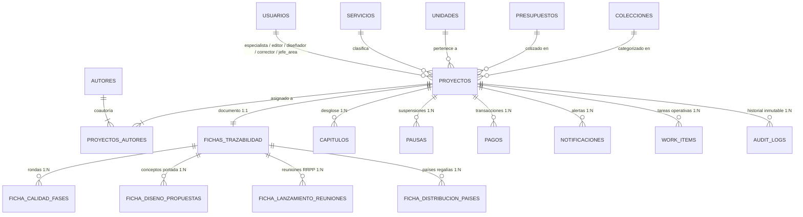

# Documento 07 — Modelo de Datos Objetivo (Target Data Model)
**Sistema:** PanHouse Gestor Editorial  
**Fecha:** Octubre 2026  
**ORM:** Drizzle ORM (TypeScript)  
**Motor:** PostgreSQL 16+  

---

## 1. Diagrama de Entidad-Relación Conceptual



---

## 2. Definición Canónica de Tablas y Esquemas Drizzle

### 2.1 Tabla de Usuarios (`usuarios`)
Centraliza las credenciales, nombres del equipo y roles del sistema.
```typescript
export const users = pgTable('usuarios', {
  id: uuid('id').primaryKey().defaultRandom(),
  email: text('email').notNull().unique(),
  passwordHash: text('password_hash').notNull(),
  nombre: text('nombre').notNull(),
  rol: rolEnum('rol').notNull(),
  activo: boolean('activo').notNull().default(true),
  autorId: uuid('autor_id').references(() => autores.id, { onDelete: 'set null' }),
  createdAt: timestamp('created_at', { withTimezone: true }).notNull().defaultNow(),
  updatedAt: timestamp('updated_at', { withTimezone: true }).notNull().defaultNow().$onUpdate(() => new Date()),
});
```

---

### 2.2 Tabla de Autores (`autores`)
Única fuente de verdad para los datos personales, de contacto y de perfil del autor.
```typescript
export const autores = pgTable('autores', {
  id: uuid('id').primaryKey().defaultRandom(),
  nombre: text('nombre').notNull(),
  nombreArtistico: text('nombre_artistico'),
  nacionalidad: text('nacionalidad').array(),
  fechaNacimiento: date('fecha_nacimiento'),
  redesSociales: jsonb('redes_sociales').$type<RedesSociales>(),
  personalidad: text('personalidad').array(),
  ocupacion: text('ocupacion'),
  email: text('email').array(),
  telefono: text('telefono'),
  pais: text('pais'),
  categoria: categoriaClienteEnum('categoria').notNull().default('Estándar'),
  createdAt: timestamp('created_at', { withTimezone: true }).notNull().defaultNow(),
  updatedAt: timestamp('updated_at', { withTimezone: true }).notNull().defaultNow().$onUpdate(() => new Date()),
});
```

---

### 2.3 Tabla de Proyectos (`proyectos`)
Entidad central que coordina el contrato, servicio, asignaciones, estados e hitos.
```typescript
export const proyectos = pgTable('proyectos', {
  id: uuid('id').primaryKey().defaultRandom(),
  codigo: text('codigo').notNull().unique(),
  autorId: uuid('autor_id').notNull().references(() => autores.id, { onDelete: 'restrict' }),
  servicioId: uuid('servicio_id').notNull().references(() => servicios.id, { onDelete: 'restrict' }),
  unidadId: uuid('unidad_id').notNull().references(() => unidades.id, { onDelete: 'restrict' }),
  presupuestoId: uuid('presupuesto_id').notNull().references(() => presupuestos.id, { onDelete: 'restrict' }),
  coleccionId: uuid('coleccion_id').references(() => colecciones.id, { onDelete: 'set null' }),

  // Asignaciones de equipo oficiales (Única fuente de verdad)
  especialistaId: uuid('especialista_id').references(() => users.id, { onDelete: 'set null' }),
  jefeAreaId: uuid('jefe_area_id').references(() => users.id, { onDelete: 'set null' }),
  editorId: uuid('editor_id').references(() => users.id, { onDelete: 'set null' }),
  correctorId: uuid('corrector_id').references(() => users.id, { onDelete: 'set null' }),
  disenadorId: uuid('disenador_id').references(() => users.id, { onDelete: 'set null' }),

  // Título canónico formal
  tituloDefinitivo: text('titulo_definitivo'),
  subtituloDefinitivo: text('subtitulo_definitivo'),

  // Estado macro y fechas
  estado: estadoProyectoEnum('estado').notNull().default('en_proceso'),
  categoriaStandBy: categoriaStandByEnum('categoria_stand_by'),
  fechaProgramadaInicio: date('fecha_programada_inicio').notNull(),
  fechaRealInicio: date('fecha_real_inicio'),
  fechaFinProyectada: date('fecha_fin_proyectada'),
  fechaDeseadaAutor: date('fecha_deseada_autor'),

  // Flags de transición y compuertas (Gates)
  notificadoRrpp: boolean('notificado_rrpp').notNull().default(false),
  notificadoJefatura: boolean('notificado_jefatura').notNull().default(false),
  solvenciaAdministrativa: boolean('solvencia_administrativa').notNull().default(false),
  contratoFirmado: boolean('contrato_firmado').notNull().default(false),

  // Portal del autor & Portada activa
  manuscritoUrl: text('manuscrito_url'),
  propuestaPortadaUrl: text('propuesta_portada_url'),
  portadaDecisionAutor: varchar('portada_decision_autor', { length: 20 }).notNull().default('pendiente'),
  portadaFeedback: text('portada_feedback'),

  // Timestamps
  createdAt: timestamp('created_at', { withTimezone: true }).notNull().defaultNow(),
  updatedAt: timestamp('updated_at', { withTimezone: true }).notNull().defaultNow().$onUpdate(() => new Date()),
});
```

---

### 2.4 Tabla de Coautoría (`proyectos_autores`)
Relación N:M entre Proyectos y Autores.
```typescript
export const proyectosAutores = pgTable(
  'proyectos_autores',
  {
    proyectoId: uuid('proyecto_id').notNull().references(() => proyectos.id, { onDelete: 'cascade' }),
    autorId: uuid('autor_id').notNull().references(() => autores.id, { onDelete: 'restrict' }),
  },
  (table) => ({
    pk: primaryKey({ columns: [table.proyectoId, table.autorId] }),
  }),
);
```

---

### 2.5 Tabla de Ficha de Trazabilidad (`fichas_trazabilidad`)
Consolida las especificaciones contractuales, editoriales y parámetros técnicos de cada área (relación 1:1 con proyectos).
- `capitulosPactados`, `paginasPactadas`, `criterioExtra`, `condicionesEspeciales` (Comercial).
- `ingresoServicioSubtipoCrudo` (`Capítulo` | `Tripa`), `ingresoServicioEjecucion`, `ingresoTiempoExpresMeses`, `ingresoServicioAlianza` (RRPP Intake).
- `temaGeneral`, `publicoSexo`, `publicoEdad`, `publicoPerfil`, `propositoSocial`, `objetivoComercial`, `tonoEstilo`, `posibleTituloLibro` (Ficha Editorial RRPP).
- Campos operativos de matrices RRPP: `matrizCiudadResidencia`, `matrizEstadoReunion`, `matrizPropietario`, `matrizVentaCruzada`, etc.
- Columnas de resumen de etapas: `edicionEstatus`, `correccionEstatus`, `disenoEstatus`, `calidadEstatus`, `digitalEstatus`, `lanzamientoEstatus`, `impresionEstatus`, `distribucionEstatus`.

---

### 2.6 Tablas de Detalle y Paralelismo

1. **`capitulos`:**
   - Una fila por capítulo o parte de entrega.
   - `numero`, `fechaEnvioAutor`, `fechaPautadaFeedback`, `fechaRespuestaReal`, `enlaces` (Drive), `fechaInicioEditor`, `fechaEntregaEditor`, `paginas`.
2. **`ficha_calidad_fases`:**
   - Soporta rondas de revisión iterativas (Fase 1, Fase 2.1..2.5, Revisión Final Fase 3, Fase 4.1..4.5).
   - `numeroFase`, `pdfVersion`, `pdfUrl`, `cantidadComentarios`, `aprobado`, `fecha`.
3. **`ficha_diseno_propuestas`:**
   - Conceptos de portada generados por Líder Creativo.
   - `fechaEnviadaEspecialista`, `aprobadoRrpp`, `fechaEnviadaAutor`, `fechaAprobadaAutor`, `enlace`, `estado`.
4. **`seguimiento_fases`:**
   - Matriz de control de tiempos y analistas/correctores para auditoría de productividad.
   - `analistaId`, `asignacionTipo`, `paginas`, `fechaAsignada`, `fechaInicio`, `fechaEntrega`, `totalDias`, `totalHoras`, `freelance`, `pago80`, `pago20`.

---

### 2.7 Entidades de Auditoría y Tareas (`audit_logs`)
**Estado: TARGET — no implementado todavía.** Verificado contra el schema real (`server/db/schema/`): esta tabla NO existe hoy. `asignarEspecialista`/`asignarEditor`/`asignarDisenador` (`server/helpers/proyectos.ts`) son hoy `UPDATE` simples sin ninguna escritura de auditoría — quién tenía el proyecto asignado antes de un cambio **se pierde hoy**, no hay forma de reconstruirlo.

Registra cada cambio crítico (quién, qué, cuándo, proyecto) asegurando trazabilidad formal sin acoplarse a las notificaciones de usuario.

```typescript
export const auditLogs = pgTable('audit_logs', {
  id: uuid('id').primaryKey().defaultRandom(),
  proyectoId: uuid('proyecto_id').notNull().references(() => proyectos.id, { onDelete: 'cascade' }),
  usuarioId: uuid('usuario_id').references(() => users.id, { onDelete: 'set null' }),
  accion: text('accion').notNull(), // ej: 'ESPECIALISTA_ASIGNADO', 'TITULO_APROBADO', 'PORTADA_APROBADA_RRPP'
  detalles: jsonb('detalles'), // Snapshot o diff de valores anteriores y nuevos
  createdAt: timestamp('created_at', { withTimezone: true }).notNull().defaultNow(),
});
```

#### 2.7.1 Decisión explícita: asignación actual (FK) vs. historial (`audit_logs`)
Para resolver sin ambigüedad la distinción que pide la rearquitectura (asignación actual que acelera consultas, vs. historial que nunca debe perderse):

- **A. Asignación actual (`proyectos.especialistaId`/`editorId`/`correctorId`/`disenadorId`):** se mantiene como FK directa en `proyectos` — es correcto como optimización, porque "¿quién tiene esto asignado AHORA?" es la consulta más frecuente del sistema (carga, "mis proyectos", ownership guard) y no debe pagar el costo de un `JOIN`/subquery contra una tabla de historial en cada lectura.
- **B. Historial de asignaciones:** se resuelve con `audit_logs`, **no** con una tabla dedicada `asignaciones_historial`. Cada cambio de `especialistaId`/`editorId`/`correctorId`/`disenadorId` escribe una fila con `accion: 'ESPECIALISTA_REASIGNADO'` (etc.) y `detalles: { anterior: <uuid|null>, nuevo: <uuid>, usuarioQueReasigna: <uuid> }`. Esto evita una segunda abstracción redundante (B no es más que "A + un evento" cada vez que A cambia) sin perder nunca quién estuvo asignado antes ni cuándo cambió.
- **Implicación de implementación (Fase 4 de `08-migration-plan.md`, MIGRATE WRITES):** `asignarEspecialista`/`asignarEditor`/`asignarDisenador`/reasignación de corrector deben pasar a escribir en `audit_logs` dentro de la misma transacción que el `UPDATE`, no como paso separado — si la escritura de auditoría falla, la reasignación tampoco debe persistir.

---

## 3. Índices y Optimización de Rendimiento

Para evitar problemas de $N+1$ y acelerar las consultas frecuentes en dashboards:
- Índice en `proyectos(estado)` para filtrar proyectos activos.
- Índice en `proyectos(especialista_id)` y `proyectos(editor_id)` para las consultas de "Mis Proyectos" y cálculo de carga.
- Índice en `proyectos(codigo)` para búsquedas instantáneas en el Command Center.
- Índice en `autores(nombre gin_trgm_ops)` para autocompletado y búsqueda difusa en CRM.
- Índice en `proyectos_autores(proyecto_id, autor_id)` para resolución en lote de coautores.
