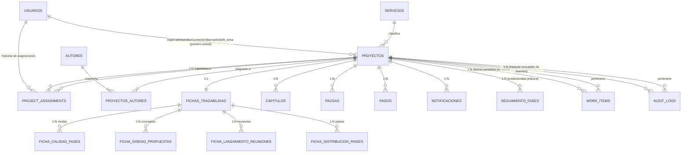

# Documento 11 — Fase 2: Modelo Canónico y Workflow Foundation
**Sistema:** PanHouse Gestor Editorial
**Fecha:** Octubre 2026
**Autor:** Claude Code (arquitecto principal desde Fase 2, tras auditoría y corrección de Fase 0/1 de Antigravity — ver `01-current-state.md §0.1`)
**Estado de este documento:** **DISEÑO (TARGET)** — ningún cambio de schema/DB fue ejecutado para producir este documento. Es el checkpoint pedido antes de iniciar Fase 3 (RBAC/seguridad) y Fase 4 (workflow core / migraciones).

> Leyenda: ver `01-current-state.md §0`. Todo lo marcado **CURRENT** fue verificado leyendo directamente `server/db/schema/*.ts` y el código real (no asumido desde la documentación previa).

---

## A. Schema CURRENT resumido

Verificado línea por línea contra `server/db/schema/*.ts` (1530 líneas totales):

| Tabla | Propósito real hoy | Notas de verificación |
|---|---|---|
| `usuarios` | Credenciales + rol + vínculo opcional a `autores` (cuentas de autor) | Sin novedades vs. docs previos |
| `autores` | Entidad maestra de persona (nombre, contacto, redes, personalidad) | Sin novedades |
| `proyectos` | Entidad central: contrato, servicio, **asignaciones FK únicas** (`especialistaId/editorId/correctorId/disenadorId/jefeAreaId`), estado macro, hitos de fecha, cuotas de pago | `titulo` es **legacy inerte** (sin ruta que lo escriba, se dejó para no romper históricos). `calidadId/digitalId/lanzamientoId/distribucionId` **ya fueron retirados** en una ronda anterior — esas 4 áreas nunca tuvieron ownership individual real, solo acceso por rol. |
| `proyectos_autores` | N:M coautoría | `proyectos.autorId` se mantiene en paralelo a propósito (migración aditiva en curso, no completada) |
| `servicios` | Catálogo de servicios + `pesoComplejidad` + plazos | `EEC`/`EET` con `activo=false` (retiradas); `CR` (Crudo) es la categoría vigente que las reemplaza en el alta |
| `unidades`, `presupuestos`, `colecciones` | Catálogos simples | Sin novedades |
| `fases`, `pasos`, `servicio_fases` | **Catálogo de fases/orden/paralelismo por servicio, ya migrado** | **HALLAZGO:** no se usa en ningún lugar del código (`grep` sin resultados fuera de su propio schema). Tabla huérfana — ver sección L. |
| `fichas_trazabilidad` | Documento 1:1 por proyecto, 9 secciones de negocio, **126 columnas propias** (no "50+" como decía `01-current-state.md §3.1` — recontado exacto en esta auditoría; las 155 de un primer conteo incluían por error las 4 tablas hijas) | Ver evaluación campo por campo en sección J/K |
| `ficha_calidad_fases` | 1:N — rondas de Calidad (`numeroFase` 1-4) | **HALLAZGO:** `UNIQUE(fichaId, numeroFase)` impide más de una fila por fase — contradice el flujo documentado de sub-rondas F2.1..F2.5 (ver sección H) |
| `ficha_diseno_propuestas` | 1:N — propuestas de portada | Ya modelado correctamente como repetible |
| `ficha_lanzamiento_reuniones` | 1:N — reuniones de lanzamiento | Ya modelado correctamente |
| `ficha_distribucion_paises` | 1:N — países/regalías | Ya modelado correctamente |
| `capitulos` | 1:N por proyecto — avance cara-autor y cara-editor en una sola fila | Ya resuelto correctamente (ver comentario propio del archivo) |
| `pausas` | 1:N — suspensiones formales con guardia de pago | Modelo sólido, con `CHECK` de integridad real. Sin cambios necesarios. |
| `seguimiento_fases` | Matriz de tiempos/productividad de jefatura (independiente del proceso editorial) | **Propósito distinto** de `fichas_trazabilidad.*Estatus` — mide rendimiento, no estado de proceso. No fusionar ciegamente (ver sección L). |
| `pagos` | Transacciones de pago 1:N | Sin novedades |
| `notificaciones` | Bandeja operativa, genérica por `rolDestino` (texto libre) | Hoy solo un disparador real (creación de proyecto → `jefe_area`) |
| `audit_logs` | **NO EXISTE** | Propuesto en `07-target-data-model.md`, nunca implementado — confirmado en la auditoría de Fase 0/1 |

---

## B. Schema TARGET (resumen de cambios respecto a CURRENT)

| Tabla | Acción |
|---|---|
| `audit_logs` | **CREAR** (ya diseñada en doc 07, confirmada aquí) |
| `project_assignments` | **CREAR** (nueva, ver sección E) |
| `work_items` | **CREAR** (nueva, ver sección F) |
| `ficha_calidad_fases` | **MODIFICAR** constraint de unicidad (ver sección H) + columnas opcionales de responsable |
| `fichas_trazabilidad` | **NO dividir en 9 tablas.** Retirar (en Fase 4+, no ahora) las 8×5 columnas `*Estatus/*FechaInicio/*FechaEntrega/*TotalDias/*Observaciones` hacia `work_items`. El resto permanece. |
| `fases`, `pasos`, `servicio_fases` | **DECISIÓN PENDIENTE** (resucitar como fuente de gates/paralelismo, o deprecar) — ver sección L |
| Resto de tablas | **CONSERVAR sin cambios estructurales** |

---

## C. Diagrama ERD del TARGET



---

## D. Tabla por tabla — Decisión

| Tabla | Decisión | Justificación breve |
|---|---|---|
| `usuarios`, `autores`, `servicios`, `unidades`, `presupuestos`, `colecciones`, `proyectos_autores`, `capitulos`, `pausas`, `pagos`, `ficha_diseno_propuestas`, `ficha_lanzamiento_reuniones`, `ficha_distribucion_paises` | **CONSERVAR** | Ya normalizadas, ya única fuente de verdad, sin redundancia detectada |
| `proyectos` | **MODIFICAR (aditivo)** | Agregar nada estructural todavía; mantener FKs de asignación actual tal cual (ver E) |
| `fichas_trazabilidad` | **MODIFICAR (conceptual, ejecución diferida a Fase 4)** | Mover 40 columnas de estado-macro hacia `work_items`; conservar el resto (ver J/K) |
| `ficha_calidad_fases` | **MODIFICAR** | Ampliar constraint de unicidad + columnas opcionales de responsable (sección H) |
| `seguimiento_fases` | **CONSERVAR, sin fusionar todavía** | Propósito distinto (medición de productividad para jefatura, no estado de proceso); evaluar fusión real solo tras ver las matrices de Soporte Editorial pendientes (GAP-03) |
| `notificaciones` | **CONSERVAR** | Modelo ya genérico y correcto |
| `fases`, `pasos`, `servicio_fases` | **DECISIÓN PENDIENTE — no destructiva de momento** | Ver sección L |
| `audit_logs` | **CREAR** | Ver E/G |
| `project_assignments` | **CREAR** | Ver E |
| `work_items` | **CREAR** | Ver F |

---

## E. Modelo de Assignments — Comparación explícita A/B/C (NO cerrado, requiere tu aprobación)

Siguiendo tu instrucción explícita de no asumir `audit_logs` como única fuente de historial de assignments, comparo las tres opciones contra los escenarios reales que pediste, verificados contra el código actual (`server/helpers/proyectos.ts`, `server/helpers/carga.ts`):

### Escenarios reales a cubrir (verificados, no hipotéticos)
- Reasignación de Especialista (hoy: 1 FK, sin historial) — `jefe_area` vía `PATCH /:id/especialista`
- Reasignación de Editor (hoy: 1 FK, sin historial) — `jefe_edicion` vía `PATCH /:id/editor`
- Corrector (hoy: 1 FK, sin historial; es freelance, sí tiene cuenta `usuarios`) — asignado por Especialista/Talento Humano, sin ruta HTTP dedicada todavía (campo existe en el modelo consolidado de equipo, `PATCH /:id/equipo`)
- Diseñador (hoy: 1 FK, sin historial) — asignado por Especialista vía `PATCH /:id/disenador`
- **Validador de Calidad (`soporte_editorial`): hoy SIN ningún FK individual.** Acceso es por rol completo, no por asignación. `ficha_calidad_fases` tampoco registra quién hizo cada ronda.
- **Líder Creativo: hoy SIN FK individual.** Acceso por rol.
- Carga ponderada (`carga.ts`) — consulta hot-path, se ejecuta en cada vista de "tablero de carga" y "mis proyectos"
- Ownership guard (`verificarAccesoAProyecto`) — se ejecuta en **cada request autenticado** de especialista/editor/disenador sobre un proyecto

### Opción A — Solo FK + audit log genérico (la que propuse inicialmente, ahora descartada como única solución)
- ✅ Cero tablas nuevas de assignment.
- ❌ `audit_logs.detalles` (jsonb) no es consultable con SQL directo ("dame todos los proyectos donde X fue especialista entre marzo y junio" requiere parsear jsonb fila por fila).
- ❌ No cubre Validador/Líder Creativo sin inventar una convención ad-hoc dentro del jsonb.
- ❌ Mezcla "qué pasó" (evento) con "quién tuvo qué rol durante qué período" (estado temporal) — exactamente la mezcla que señalaste que no quieres.

### Opción B — FK actual + tabla normalizada `project_assignments` (RECOMENDADA)
- ✅ `proyectos.especialistaId` etc. se mantienen intactas — **cero impacto** en `carga.ts` ni en `verificarAccesoAProyecto` (siguen siendo lecturas de una sola columna, sin JOIN extra en el hot path).
- ✅ `project_assignments` responde con SQL directo: "¿quién estuvo asignado, durante qué período, por rol, en qué proyecto?" — incluyendo roles que HOY no tienen FK (Validador, Líder Creativo) sin forzarlos a vivir en `proyectos`.
- ✅ Escala naturalmente a "múltiples Correctores" o "Validadores por ronda" sin romper la columna FK de `proyectos` (que sigue representando solo el "actual").
- ✅ `audit_logs` queda limpio para su propósito real: "qué ocurrió" (evento puntual), no duplicando el rol de tabla de estado temporal.
- ⚠️ Una tabla nueva + lógica para mantenerla sincronizada con los FK de `proyectos` (mismo `UPDATE` debe escribir ambos, en la misma transacción).

**Diseño propuesto (conceptual, no DDL final todavía):**
```typescript
export const projectAssignments = pgTable('project_assignments', {
  id: uuid('id').primaryKey().defaultRandom(),
  proyectoId: uuid('proyecto_id').notNull().references(() => proyectos.id, { onDelete: 'cascade' }),
  rol: rolEnum('rol').notNull(), // reutiliza el enum de roles existente — especialista/editor/disenador/soporte_editorial/lider_creativo, etc.
  usuarioId: uuid('usuario_id').notNull().references(() => users.id, { onDelete: 'restrict' }),
  asignadoPorId: uuid('asignado_por_id').references(() => users.id, { onDelete: 'set null' }),
  asignadoEn: timestamp('asignado_en', { withTimezone: true }).notNull().defaultNow(),
  finalizadoEn: timestamp('finalizado_en', { withTimezone: true }), // null = asignación activa
  motivo: text('motivo'), // opcional: por qué se reasignó
  contexto: jsonb('contexto'), // opcional, mínimo: ej. { rondaCalidad: 2 } para Validador por ronda — NO reemplaza columnas reales, solo metadata marginal
  createdAt: timestamp('created_at', { withTimezone: true }).notNull().defaultNow(),
}, (table) => ({
  // A lo sumo UNA asignación activa por (proyecto, rol) a la vez — mismo
  // invariante que ya implica el FK único en `proyectos` hoy.
  unaActivaPorRol: uniqueIndex('project_assignments_activa_unica')
    .on(table.proyectoId, table.rol)
    .where(sql`${table.finalizadoEn} IS NULL`),
}));
```
- Escritura: cada `asignarEspecialista`/`asignarEditor`/`asignarDisenador`/futuras asignaciones de Validador/Líder Creativo pasan a, **en una sola transacción**: (1) cerrar la fila activa anterior en `project_assignments` si existe (`finalizadoEn = now()`), (2) insertar la nueva fila activa, (3) actualizar el FK en `proyectos` (solo para los 4 roles que lo tienen hoy), (4) insertar en `audit_logs` el evento puntual.

### Opción C — Work items/assignments como una sola abstracción
- Evaluada y **descartada** para el caso de assignments: un "work item" (tarea con estado pendiente/en_progreso/completado) y una "asignación" (quién tiene un rol sobre el proyecto durante un período) son conceptualmente distintos — un Especialista puede estar "asignado" a un proyecto durante 6 meses sin que eso sea una tarea con estado binario de completado/pendiente. Fusionarlos obligaría a `work_items` a tener campundas tipo `finalizadoEn`/`asignadoPorId` que no aplican a tareas reales (ej. "Fase 1 de Calidad"), o a `project_assignments` a tener estados que no le corresponden ("bloqueado por gate"). Se mantienen como dos tablas separadas, coexistiendo (igual que `audit_logs`/`project_assignments`).

**Recomendación: Opción B.** Queda explícitamente **sin cerrar** hasta tu aprobación, según tu instrucción — no se creará esta tabla todavía.

---

## F. Modelo de Work Items

**Hallazgo que motiva esta tabla (verificado, no hipotético):** `fichas_trazabilidad` tiene 8 bloques estructuralmente idénticos — uno por área (`edicion`, `correccion`, `diseno`, `calidad`, `digital`, `lanzamiento`, `impresion`, `distribucion`) — cada uno con el mismo patrón de 5 columnas: `<area>Estatus` (text), `<area>FechaInicio` (date), `<area>FechaEntrega` (date), `<area>TotalDias` (numeric), `<area>Observaciones` (text). Son **40 columnas** que son, en esencia, la misma entidad repetida 8 veces en lugar de 8 filas de una tabla.

```typescript
export const workItems = pgTable('work_items', {
  id: uuid('id').primaryKey().defaultRandom(),
  proyectoId: uuid('proyecto_id').notNull().references(() => proyectos.id, { onDelete: 'cascade' }),
  tipo: workItemTipoEnum('tipo').notNull(), // 'edicion'|'correccion'|'diseno'|'calidad'|'soporte_digital'|'lanzamiento'|'impresion'|'distribucion'
  estado: workItemEstadoEnum('estado').notNull().default('pendiente'), // 'pendiente'|'en_progreso'|'bloqueado'|'completado'|'cancelado'
  gateBloqueante: text('gate_bloqueante'), // código del gate que lo condiciona (ver sección I), nullable
  fechaInicioPautada: date('fecha_inicio_pautada'),
  fechaFinPautada: date('fecha_fin_pautada'),
  fechaInicioReal: date('fecha_inicio_real'),
  fechaFinReal: date('fecha_fin_real'),
  totalDias: numeric('total_dias', { precision: 6, scale: 2 }), // mismo criterio que seguimiento_fases: a veces no es la resta exacta
  observaciones: text('observaciones'),
  metadata: jsonb('metadata'), // extras puntuales por tipo, sin forzar columna nueva para un solo caso de uso
  createdAt: timestamp('created_at', { withTimezone: true }).notNull().defaultNow(),
  updatedAt: timestamp('updated_at', { withTimezone: true }).notNull().defaultNow().$onUpdate(() => new Date()),
}, (table) => ({
  unoPorTipo: unique('work_items_proyecto_tipo_unique').on(table.proyectoId, table.tipo),
}));
```

**Qué NO cambia:** `capitulos` (rondas de edición por capítulo), `ficha_calidad_fases` (rondas de calidad), `ficha_diseno_propuestas` (propuestas de portada) y `ficha_lanzamiento_reuniones` (reuniones) **ya son** tablas de detalle correctas — `work_items` es la vista macro de "en qué estado está el área", no reemplaza el detalle fila-a-fila que ya existe en esas 4 tablas. Esto responde directamente a tu objetivo 8 (paralelismo): al ser filas independientes por `(proyecto, tipo)`, el paralelismo es estructural, no un enum plano.

**Relación con el `WorkItem` ya propuesto en `06-workflow-model.md`:** ese documento proponía tipos muy granulares (`EDICION_CAPITULO`, `FEEDBACK_AUTOR_CAPITULO`, etc.). Esta tabla es deliberadamente más macro (8 tipos, uno por área) porque el detalle granular **ya existe** en tablas dedicadas (`capitulos`, `ficha_calidad_fases`). Evita construir un motor BPM genérico — exactamente lo que pediste no hacer.

---

## G. Modelo de Audit Log

Confirmado el diseño de `07-target-data-model.md §2.7`, con la precisión de `§2.7.1` agregada en la auditoría de Fase 0/1: `audit_logs` responde **"¿qué ocurrió?"** (eventos puntuales e inmutables), nunca "¿quién está asignado ahora?" (eso lo resuelve el FK en `proyectos`) ni "¿quién estuvo asignado durante qué período?" (eso lo resuelve `project_assignments`, sección E — pendiente de aprobación).

Eventos a registrar (ampliando la lista de `06-workflow-model.md §5` con los que ya están implementados en código pero sin auditoría hoy):
`PROYECTO_CREADO`, `LISTO_PARA_RRPP`, `RRPP_NOTIFICADO`, `INTAKE_RRPP_COMPLETADO`, `JEFATURA_NOTIFICADA`, `ESPECIALISTA_ASIGNADO`/`REASIGNADO`, `EDITOR_ASIGNADO`/`REASIGNADO`, `DISENADOR_ASIGNADO`/`REASIGNADO`, `CORRECTOR_ASIGNADO`/`REASIGNADO`, `TITULO_APROBADO`, `REUNION_CREATIVA_SOLICITADA`, `CONCEPTO_PORTADA_APROBADO_RRPP`, `PORTADA_APROBADA_AUTOR`, `VALIDACION_INICIADA`, `SOPORTE_DIGITAL_ACTIVADO`, `PAUSA_INICIADA`/`FINALIZADA`, `SOLVENCIA_CERTIFICADA`, `PROYECTO_CULMINADO`.

---

## H. Modelo de Calidad / Rondas

**Ya correctamente modelado como entidad repetible** (`ficha_calidad_fases`, 1:N) — no se requiere `validacion1/validacion2/...`. **Hallazgo de un gap real:**

```typescript
// server/db/schema/trazabilidad.ts — actual:
fichaFaseUnica: unique('ficha_calidad_fases_ficha_numero_unique').on(table.fichaId, table.numeroFase),
numeroFaseValido: check('ficha_calidad_fases_numero_valido', sql`${table.numeroFase} between 1 and 4`),
```
Esto permite **como máximo una fila por fase** (1, 2, 3 o 4) por ficha. Pero `02-business-flow.md §3.6` documenta sub-rondas iterativas reales dentro de la Fase 2 (**F2.1 a F2.5**) y la Fase 4 (**F4.1 a F4.5**) — hoy **no se pueden registrar** sin violar el `UNIQUE` actual.

**Corrección propuesta (aditiva, no destructiva):**
```typescript
// Cambiar el unique de (fichaId, numeroFase) a (fichaId, numeroFase, pdfVersion)
// — pdfVersion ya existe como texto libre ('V1.0', 'V2.1', 'V2.2'...) y es
// precisamente el campo que distingue cada sub-ronda dentro de una fase.
fichaFaseVersionUnica: unique('ficha_calidad_fases_ficha_numero_version_unique')
  .on(table.fichaId, table.numeroFase, table.pdfVersion),
```
Esto es una ampliación pura (de 2 columnas a 3 en el `UNIQUE`) — nunca rompe datos existentes, solo permite más filas de las que antes estaban bloqueadas.

**Columnas opcionales recomendadas (no obligatorias, nullable):** `validadorId uuid references users.id` — hoy no existe forma de saber quién hizo cada ronda de validación. Se deja marcado `PENDIENTE` hasta que lleguen las matrices de Soporte Editorial (GAP-03, `10-known-business-gaps.md`) — no se agrega sin fuente, pero se señala como hueco real detectado en esta auditoría.

---

## I. Gates y Dependencias

**Decisión: NO crear una tabla `gates` en la base de datos.** Los 8 gates documentados (`06-workflow-model.md §3`) son un catálogo pequeño, estable y de lógica de negocio — no de datos que cambien en runtime. Crear una tabla para esto sería, literalmente, el "crear una tabla porque sí" que pediste evitar.

**Recomendación:** centralizar en un módulo `server/helpers/gates.ts` — mismo patrón que ya usa `server/helpers/preparacionComercial.ts` para GATE-01 (`evaluarPreparacionComercial` → `{ listoParaRrpp, faltantes }`, ya implementado y ya reutilizado, nunca duplicado en React). Cada gate se expresa como una función pura `evaluarGateXxx(datos): { desbloqueado: boolean; faltantes: string[] }`, consumida tanto por los endpoints de escritura (para rechazar la acción si el gate no está desbloqueado) como por el frontend (para mostrar el estado sin duplicar la regla).

| Gate | Función propuesta | Estado de implementación hoy |
|---|---|---|
| GATE-01 Listo para RRPP | `evaluarPreparacionComercial` | **CURRENT, ya implementado** |
| GATE-02 Definición de Crudo | — | TARGET |
| GATE-03 Asignación Formal | — | TARGET |
| GATE-04 Título y Subtítulo Aprobados | — | TARGET (bloqueaba hoy nada — confirmado en `docs/auditoria/contradicciones-negocio.md §6`) |
| GATE-05 Aprobación Interna de Portada | — | TARGET (hoy `PATCH /:id/propuesta-portada` expone directo al autor sin gate, confirmado) |
| GATE-06 Muestra de Diagramación | — | TARGET |
| GATE-07 Cierre de Iteraciones de Calidad | — | TARGET |
| GATE-08 Solvencia Administrativa | — | TARGET |

---

## J. Campos que salen conceptualmente de `fichas_trazabilidad` (hacia `work_items`, Fase 4+)

Las 40 columnas (8 áreas × 5 campos): `edicionEstatus/FechaEnvioEditor/FechaRecepcionEditor/FechaEnvioAutor/FechaAprobacionAutor/Observaciones` (nota: Edición tiene nombres distintos a las otras 7, revisar caso especial), `correccionEstatus/FechaEnvio/FechaInicio/FechaEntrega/TotalDias/Observaciones`, `disenoEstatus/FechaInicio/FechaEntrega/TotalDias/Observaciones`, `calidadEstatus/FechaInicio/FechaEntrega/TotalDias/Observaciones`, `digitalEstatus/FechaInicio/FechaEntrega/TotalDias/Observaciones`, `lanzamientoEstatus/FechaInicio/FechaEntrega/TotalDias/Observaciones`, `impresionEstatus/FechaInicio/FechaEntrega/TotalDias/Observaciones`, `distribucionEstatus/FechaInicio/FechaEntrega/TotalDias/Observaciones`.

**Nota de precisión:** la sección Edición tiene su propio patrón de columnas (`edicionFechaEnvioEditor/FechaRecepcionEditor/FechaEnvioAutor/FechaAprobacionAutor`) distinto a las otras 7 — no es un caso idéntico, se mapea a `work_items.metadata` o se evalúa caso por caso en Fase 4, no se fuerza al mismo molde sin revisión.

## K. Campos que permanecen en `fichas_trazabilidad`

Todo lo demás: datos contractuales de Comercial (`capitulosPactados`, `paginasPactadas`, `criterioExtra`, `condicionesEspeciales`), datos de ingreso (`ingreso*`), Ficha Editorial de RRPP (`temaGeneral`, `publicoSexo/Edad/Perfil`, `propositoSocial`, `objetivoComercial`, `tonoEstilo`, `posibleTituloLibro`, `coleccionPanhouse`), Matriz de Ingreso (`matriz*`), Lanzamiento y Promoción — Fase 1 (`lanzamientoPromocion*`), Matriz de Asesorías (`asesoria*`), detalle de Corrección por categoría (`correccionTripaCompleta/Preliminares/CubiertaExtendida` + fechas/aprobado — esto es detalle real, no resumen macro), Brief de Diseño (`disenoBriefCreativo`, `disenoTipoPortada`, fechas de brief), datos puntuales de Soporte Digital (`soporteDigitalCuentaAmazon`, fechas) e Impresión (`impresionDeseaCotizacion`, `impresionResponsable`, `impresionEstadoCotizacion`, `impresionNotas`). Estos SÍ son datos de contenido propios de cada sección, no estado-macro duplicado.

## L. Redundancias y decisiones diferidas

1. **`proyectos.titulo`** — legacy inerte, confirmado sin ningún lector/escritor. No se borra (dato histórico), se marca definitivamente deprecado en código con comentario — ya lo está.
2. **`calidadId/digitalId/lanzamientoId/distribucionId`** — ya retirados en una ronda previa (confirmado, no hay nada que hacer).
3. **`fases`/`pasos`/`servicio_fases`** — **DECISIÓN ABIERTA, no la cierro unilateralmente:** esta tabla ya resuelve exactamente el problema de "orden y paralelismo configurable por servicio" (mismo `orden` = paralelo, distinto = secuencial) que el workflow necesita, pero está huérfana (0 referencias en código). Dos caminos: (a) resucitarla como la fuente real de secuencia/paralelismo de `work_items` por tipo de servicio, evitando duplicar esa lógica; (b) deprecarla formalmente si se concluye que los 8 `work_items.tipo` fijos + gates explícitos ya cubren la necesidad sin configuración dinámica. Mi inclinación es (a) — ya está migrada y pagada, reutilizarla es más barato que un catálogo nuevo — pero la dejo para tu confirmación en el reporte de Fase 2, no es parte del grupo de assignments que ya marcaste como pendiente pero es análogo: una tabla existente cuyo rol final no está decidido.
4. **`estado = 'retrasado'`** en `proyectos` — confirmado que **nunca se escribe** en ningún lugar del código (`grep` sin resultados de asignación). El riesgo/retraso real ya se calcula 100% derivado en tiempo real (`evaluarRiesgoProyecto`, sin persistir). Es un valor de enum muerto hoy — posible candidato a uso manual futuro (que jefatura lo fije a mano) o a eliminarse del enum; no se toca en Fase 2, solo se documenta.
5. **`seguimiento_fases` vs. `work_items` propuesta** — se parecen estructuralmente pero **no se fusionan**: `seguimiento_fases` mide productividad para jefatura (columnas de pago freelance, horas, analista vs. especialista del Excel real) mientras que `work_items` modela el estado del proceso. Revisar fusión real solo cuando lleguen las 2 matrices de Soporte Editorial pendientes.

## M. Índices y Constraints (adicionales a los ya confirmados en `07-target-data-model.md §3`)

- `work_items(proyecto_id, tipo)` — UNIQUE (ya especificado arriba)
- `work_items(estado)` — índice parcial para "tareas bloqueadas/en progreso" en dashboards
- `project_assignments(proyecto_id, rol)` — UNIQUE parcial `WHERE finalizado_en IS NULL` (ya especificado)
- `project_assignments(usuario_id, finalizado_en)` — para "historial de asignaciones de esta persona"
- `audit_logs(proyecto_id, created_at)` — para timeline por proyecto
- `ficha_calidad_fases` — ampliar UNIQUE existente (ver sección H)

## N. Plan exacto de migraciones aditivas (Fase 4, no ejecutado todavía)

Siguiendo el ciclo ya documentado en `08-migration-plan.md`:

1. **ADD:** crear `audit_logs` (ya diseñada, sin pendientes de decisión). Crear `work_items` (diseño de sección F). Si se aprueba Opción B de assignments: crear `project_assignments`. Ampliar `UNIQUE` de `ficha_calidad_fases` (sección H).
2. **BACKFILL:** una fila en `work_items` por cada combinación `(proyecto, área)` que ya tenga algún dato en las columnas `*Estatus/*Fecha*` actuales de `fichas_trazabilidad` — nunca sintetizar datos que no existen, solo copiar lo ya presente. Si se aprueba `project_assignments`: una fila activa por cada FK de asignación actualmente no nula en `proyectos` (con `asignadoEn = proyectos.createdAt` como aproximación honesta, documentada como tal).
3. **MIGRATE READS:** endpoints de lectura de carga/riesgo/"mis proyectos" empiezan a leer de `work_items` donde aplique, sin quitar las columnas viejas todavía.
4. **MIGRATE WRITES:** `asignarEspecialista`/`asignarEditor`/`asignarDisenador` pasan a escribir también en `project_assignments` + `audit_logs` dentro de la misma transacción (ver E). Los formularios de sección (Edición/Corrección/Diseño/etc.) pasan a escribir en `work_items` en vez de las columnas `*Estatus`.
5. **VERIFY:** suite completa + consultas de consistencia (0 proyectos sin fila de `work_items` para áreas con datos legacy, 0 `project_assignments` activas duplicadas por rol).
6. **DEPRECATE:** las 40 columnas de `fichas_trazabilidad` quedan marcadas inertes en código (como ya se hizo con `proyectos.titulo`), sin DROP hasta un ciclo completo de release.

## O. Riesgos

- **Riesgo de sincronización dual** durante la transición: mientras `proyectos.especialistaId` y `project_assignments` coexistan, un bug que actualice uno sin el otro genera inconsistencia silenciosa — mitigación: toda escritura pasa por una única función helper, nunca `UPDATE` directo disperso (mismo patrón que ya sigue `asignarEspecialista` hoy, solo que ampliado).
- **Riesgo de sobre-alcance:** la tentación de "ya que estamos, dividir fichas_trazabilidad en 9 tablas" — explícitamente rechazada en este documento (sección J/K), pero vale repetirlo como riesgo de desviación en Fase 4.
- **Riesgo de atar `work_items.tipo` a un enum cerrado demasiado pronto** si aparece una nueva matriz (Dirección Creativa, Soporte Editorial) que requiera un tipo adicional — mitigado con `metadata jsonb` para extras marginales, pero un tipo nuevo de área sí requeriría una migración `ALTER TYPE ... ADD VALUE`, aceptable y aditiva.

## P. Decisiones de negocio que siguen pendientes (no las cierro yo)

1. **Modelo de assignments — Opción B propuesta, sin aprobar todavía** (sección E).
2. **Destino de `fases`/`pasos`/`servicio_fases`** — resucitar vs. deprecar (sección L.3).
3. Magnitud exacta de pesos de carga — ya marcado `PENDIENTE_DEFINICION_PESOS_CARGA`, no tocado en esta fase por tu instrucción explícita.
4. `validadorId` en `ficha_calidad_fases` — pendiente de las matrices de Soporte Editorial (GAP-03).
5. Fórmula exacta de GAP/GAP2 (Matriz IA) — ya marcado `PENDIENTE_VALIDACION_DOCUMENTAL` en doc 10, sin cambios.

## Q. Tests que deberán acompañar cada cambio (Fase 4, al implementar)

- `work_items`: creación idempotente en backfill, un test por área confirmando que el dato legacy se preserva exacto.
- `project_assignments` (si se aprueba): reasignación cierra la fila anterior y abre una nueva en la misma transacción; el índice único parcial rechaza dos asignaciones activas simultáneas para el mismo `(proyecto, rol)`; historial completo recuperable por usuario.
- `audit_logs`: cada acción de la lista en sección G genera exactamente una fila, con `detalles` conteniendo el diff correcto.
- `ficha_calidad_fases`: el nuevo `UNIQUE` permite múltiples `pdfVersion` dentro de la misma `numeroFase` sin violar integridad; el `CHECK` de `numeroFase between 1 and 4` se mantiene.
- Regresión completa de `tests/proyectos.routes.test.ts`, `tests/trazabilidad.routes.test.ts`, `tests/especialistas.routes.test.ts`, `tests/editores.routes.test.ts` (todos tocan asignación/carga) tras cada paso de MIGRATE WRITES.

---

## Checkpoint (según tu instrucción)

Este documento es el modelo final de Fase 2. **No se ejecutó ninguna migración ni transformación estructural de la DB para producirlo** — es puramente diseño/análisis, como pediste. Quedan 2 decisiones explícitamente sin cerrar (sección E: Opción B de assignments; sección L.3: destino de `fases/pasos/servicio_fases`) a la espera de tu aprobación antes de iniciar la ejecución en Fase 3/4.
